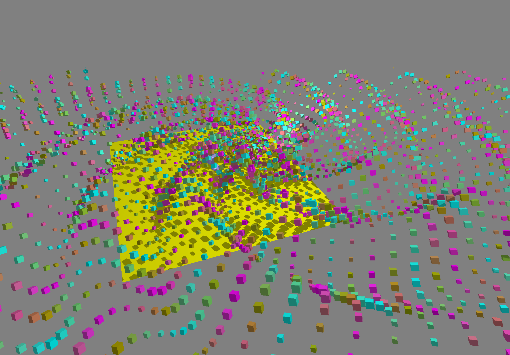

Simple 3D Model Renderer
========================

A simple 3D scene renderer for Love2D 11.3. Support simple lighting.

The goal of this project is to easily and quickly create and render 3D geometric scenes through code. On this basis, to support complex 3D model rendering.


## Features

* Create model from `.obj` model file
* Create basic model: `plane`, `cycle`, `box`, `cylinder`, `sphere`.
* `perspective` and `orthogonal` camera.
* Project Love2D drawing to 3D world.
* Simple render scene with light and shadow.
* Simple PBR
* Support deferred shading by `DeferredRenderer`
* Support SSAO by `DeferredRenderer`


## Example




## Installation

Copy `src` to your project.

Copy [CPML](https://github.com/excessive/cpml) to your project. And make sure able to `require 'cpml'`


## Usage

```
local MR = require 'model_renderer'

-- Create model from obj file or basic shape
local ground = MR.model.new_plane(2000, 2000)
local model = MR.model.load('3d.obj')
local box = MR.model.new_box(50)
local sphere = MR.model.new_sphere(30)
local cylinder = MR.model.new_cylinder(30, 100)

local renderer, scene, camera

function love.load()
  -- Initalize render, scene and camera
  renderer = MR.renderer.new()
  renderer.light_pos = { 1000, 2000, 1000 }
  renderer.light_color = { 500000, 500000, 500000 }
  renderer.ambient_color = { 0.05, 0.05, 0.05 }
  scene = MR.scene.new()
  camera = MR.camera.new()

  ground:set_opts({ instance_usage = 'static' })
  ground:set_instances({
    { coord = { -1000, 0, -1000 }, albedo = { 0, 0.9, 0 }, physics = { roughness = 1, metallic = 0 } }
  })
end

function love.draw()
  local w, h = love.graphics.getDimensions()
  local hw, hh = w * 0.5, h * 0.5

  -- Set camera projection and view, and apply camera for renderer
  camera:orthogonal(-hw, hw, hh, -hh, -500, 2000)
  camera:look_at(0, 0, 0, math.rad(60), 0, 0)
  renderer:apply_camera(camera)

  local ts = love.timer.getTime()

  -- Add some model to scene
  scene:add_model(ground) -- static model
  -- dynamic model instances: coord, angle, scale, albedo, physics attributes { roughness, metallic }
  scene:add_model(model, { 0, 0, 0 }, { 0, math.sin(ts) * math.pi * 2, 0 }, 10, { 0, 1, 0, 1 }, { 0.5, 0.5 })
  scene:add_model(model,
    { math.sin(ts) * 100, 0, math.cos(ts) * 100 },
    { 0, math.rad(45), 0 }, 10, { 1, 0, 0, 1 }, { 0.5, 0.5 }
  )

  local angle = { 0, ts % (math.pi * 2), 0 }
  scene:add_model(box, { -300, 0, 0 }, angle)
  scene:add_model(sphere, { -300, 0, 300 }, angle)
  scene:add_model(cylinder, { 300, 0, 300 }, angle)

  love.graphics.clear(0.5, 0.5, 0.5)
  -- Render and clean scene
  renderer:render(scene:build())
  scene:clean()
end
```

See examples folder for more.

## Functions

### Model

* MR.model.new(vertices, texture, opts): new a custom model form vertices. vertex: { x, y, z, tex_x, tex_y, normal_x, normal_y, normal_z }. opts is the same as `model:set_opts`

```
MR.model.new(vertices)
MR.model.new(vertices, opts)
MR.model.new(vertices, texture)
MR.model.new(vertices, texture, opts)
```

* MR.model.load(path): load a model from `.obj` file
* MR.model.new_plane(width, height)
* MR.model.new_circle(radius, segments)
* MR.model.new_box(xlen, ylen, zlen)
* MR.model.new_cylinder(radius, height, segments)
* MR.model.new_sphere(radius_x, radius_y, radius_z, segments)
* Model:set_texture(texture): image or canvas
* Model:set_opts(opts).

```
-- default value
model:set_opts({
  write_depth = true,
  face_culling = 'back', -- 'back', 'front', 'none'
  instance_usage = 'dynamic', -- see love2d SpriteBatchUsage. dynamic, static, stream.
  mesh_format = {
    { 'VertexPosition', 'float', 3 },
    { 'VertexTexCoord', 'float', 2 },
    { 'VertexNormal', 'float', 3 },
  },
  instance_mesh_format = {
    { 'ModelPos', 'float', 3 },
    { 'ModelAngle', 'float', 3 },
    { 'ModelScale', 'float', 3 },
    { 'ModelAlbedo', 'byte', 4 },
    { 'ModelPhysics', 'byte', 4 },
  },
  instance_attrs_parser = function(attrs) end, -- to parse attrs for model:set_instances
 }
})
```

> Note: `mesh_format` and `instance_mesh_format` only allow set by `MR.model.new`

* Model:set_instances(attrs): { { coord = vec3, rotation = vec3, scale = number or vec3, albedo = rgb or rgba, physics = vec2 or { roughness = v, metallic = v } }, ... }. Set instances for render. build attributes and call `model:set_raw_instances(raw_transforms)` to attach.

```
model:set_instances({
  { coord = { x, y, z } }, -- instance 1
  { coord = { x = x, y = y, z = z }, physics = { roughness = 0.5, metallic = 0.2 } }, -- instance 2
  { coord = Cpml.vec3(x, y, z), physics = { 0.5, 0.2 } }, -- instance 3, it's the same as instance 3
  { coord = { x, y, z }, rotation = { x = 1, y = 2, z = 3 }, albedo = { 0.5, 0.5, 0 } }, -- instance 4
  { coord = { x, y, z }, rotation = { 1, 2, 3 }, albedo = { r = 0.5, g = 0.5, b = 0 } }, -- instance 5, it's the same as instance 4
  { coord = { x, y, z }, albedo = { r = 0.5, g = 0.5, b = 0, a = 1 } }, -- for now, alpha is not well supported
  { coord = { x, y, z }, scale = 2 }, -- instance 7
  { coord = { x, y, z }, scale = { 2, 2, 2 } }, -- it's the same as instance 7
  { coord = { x, y, z }, scale = { x = 2, y = 2, z = 2 } }, -- it's the same as instance 7
})
```

* Model:set_raw_instances(raw_attrs): { { x, y, z, rotate_x, rotate_y, rotate_z, scale_x, scale_y, scale_z, albedo_r, albedo_g, albedo_b, albedo_a, roughness, metallic }, ... }. Set intances for render, it will create(if not created or vertices_count < #raw_attrs) a mesh to save all instances data and attach to the model.


### Renderer

`MR.renderer`(Support Love2D MSAA) and `MR.deferred_renderer`(FXAA)

* Renderer.new() return a new instance

```lua
local renderer = MR.renderer.new()
-- or 
local renderer = MR.deferred_renderer.new()
```

* renderer:apply_camera(camera_instance): the camera must initialized projection and view. fetch all camera attributes and apply to renderer.
* renderer:render(scene_desc)

```
renderer:render({ model = { model1, model2, ... } })
```

**Camera Attributes**

* renderer.projection: column major 4x4 matrices
* renderer.view: column major 4x4 matrices
* renderer.view_scale: number, scale the shadow view size, default is 1
* renderer.camera_pos: { x, y, z }, must set before render
* renderer.look_at: { x, y, z }, must set before render

**Light & Shadow Attributes**

* renderer.render_shadow: boolean, change it to enable/disable shadow.
* renderer.light_pos: vec3
* renderer.light_color: vec3. light radiance strength
* renderer.sun_dir: vec3, sun direction, shadow is use this.
* renderer.sun_color: vec3
* renderer.ambient_color: vec3


**Other Attributes**

* renderer.skybox: a cubeimage texture. A demo in examples/pbr.lua


### Scene

It is optional, you can also manually build scene description for renderer.

* MR.scene.new() return scene instance
* scene:add_model(model, coord, angle, scale, albedo, physics): add a model to scene. Coord is required, other is optional

  * coord: { x, y, z } or { x = x, y = y, z = z }
  * angle: { x, y, z } or { x = x, y = y, z = z }, defualt { 0, 0, 0 }
  * scale: { x, y, z } or { x = x, y = y, z = z }, default { 1, 1, 1 }
  * albedo: { r, g, b, a } or { r = r, g = g, b = b, a = a }, now alpha is unused.
  * physics: { roughness, metallic } or { roughness = 0.5, metallic = 0.5 }. value 0.0-1.0

* scene:clean(): reset scene, remove all models from scene.
* scene:build(): build scene for renderer. `renderer:render(scene:build())`. Automatically apply all transforms to models by `model:set_instances`


### Camera

It is optional, you can also manually set all camera attributes for renderer.

* MR.camera.new() return camera instance
* camera:perspective(fovy, aspect, near, far) create perspective projection for this camera
* camera:orthogonal(left, right, top, bottom, near, far) create orthogonal projection for this camera
* camera:move_to(x, y, z, rx, ry, rz) move camera to the position, set camera angle and update view
* camera:look_at(x, y, z, rx, ry, rz) look at the position use the specified angle and update view
* camera:project(point, viewport) project the world point to screen. point: Cpml.vec3 or { x = x, y = y, z = z }. viewport: { ox, oy, w, h }
* camera:unproject(screen_x, screen_y, viewport, plane) unproject the screen point to world. viewport: { ox, oy, w, h }. plane: { position = vec3, normal = vec3 }, default is { position = vec3(0, 0, 0), normal = vec3(0, 1, 0) }
* camera:attach(plane_transform) project love 2D drawing to 3D world. the `plane_transform` is a matrix to transform the 2d plane. plane_transform is optional, default just rotate `math.pi * 0.5` based on x(transform `y` of 2D to z of `3D`). The function will call `love.graphics.setShader`
* camera:detach()


### Util

Some helper functions.

* `MR.util.send_uniform(shader, name, ...)`: check has uniform before sending uniform.

```
-- equal to
if shader:hasUniform(name) then 
  shader:send(k, ...)
end
```

* `MR.util.compute_face_normal(vertex1, vertex2, vertex3)`: return normal { x, y, z }
* `MR.util.generate_vertices(vertices, faces, build_cb)`: generate model vertices from vertices and face

```
-- auto compute face normal
MR.util.generate_vertices(
  {{ 0, 0, 0 }, { 1, 0, 0 }, { 1, 0, 1 }, { 0, 0, 1 }},
  {{ 1, 2, 3 }, { 2, 3, 4 }}
)

-- use custom vertex normal
MR.util.generate_vertices(
  {{ x, y, z }, { x2, y2, z2 }, { x3, y3, z3 }, { x4, y4, z4 }},
  {
    { { 1, vn = { 0, 1 ,0 } }, { 2, vn = { 0, 1, 0 } }, { 3, vn = { 0, 1, 0 } } },
    { 2, 3, 4 } -- auto compute face normal
  }
)

-- build custom vertex
MR.util.generate_vertices(
  {{ 0, 0, 0 }, { 1, 0, 0 }, { 1, 0, 1 }, { 0, 0, 1 }},
  {{ 1, 2, 3 }, { 2, 3, 4 }},
  function(vertex, normal)
    return { vertex[1], vertex[2], vertex[3], normal[1], normal[2], normal[3], unpack(vertex, 4) }
  end
)
```


## TODO

* More support for model file(mtl, tex and more)
* Support Normal, Albedo, Metallic, Roughness and AO texture map
* Better light & shadow(CSM or other). more light sources
* Build better geometry mesh. (vertices, normal or texture coord)
* More 3D geometry shapes
* Support Blend transparent object


## References

* [LearnOpenGL](https://learnopengl.com/)
* [LOVEPBR](https://github.com/pablomayobre/LOVEPBR)
