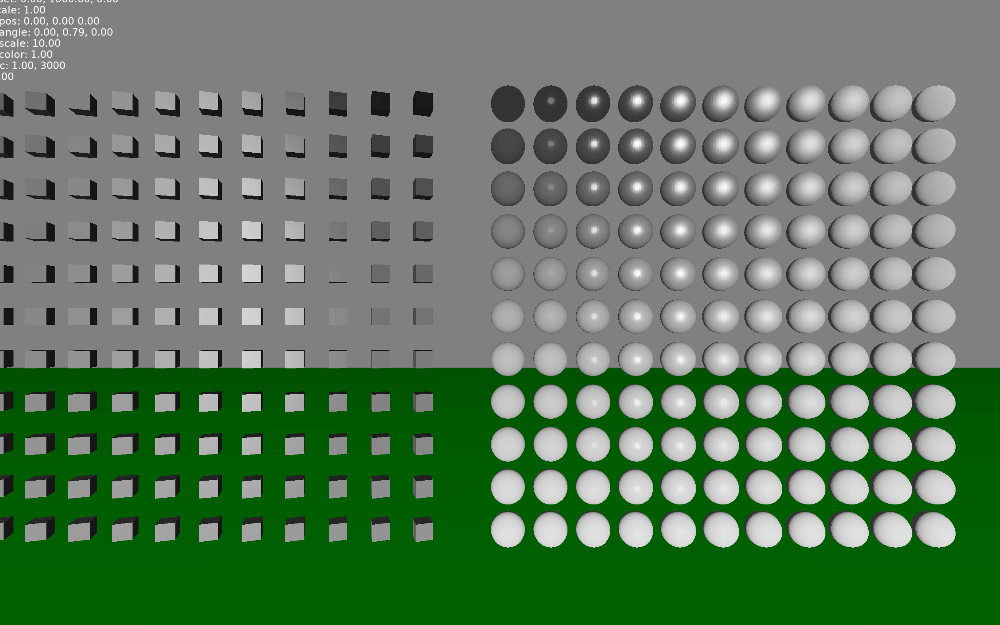

Simple 3D Model Renderer
========================

A simple 3D model renderer for Love2D 11.3. Support ambient light and diffuse.

## Example




## Installation

Copy `src` to your project.

And recommend use [CPML](https://github.com/excessive/cpml) to build projection and view matrix.


## Usage

```
local MR = require 'model_renderer'
local Cpml = require 'cpml'

local model = MR.model.load('3d.obj')
local box = MR.model.new_box(50)
local sphere = MR.model.new_sphere(30)
local cylinder = MR.model.new_cylinder(30, 100)

function love.load()
  MR.set_render_opts({
    light_pos = { 1000, 2000, 1000 },
    light_color = { 1, 1, 1 },
    ambient_color = { 0.6, 0.6, 0.6 },
  })
end

function love.draw()
  local w, h = love.graphics.getDimensions()
  local hw, hh = w * 0.5, h * 0.5

  local projection = Cpml.mat4.from_ortho(-hw, hw, hh, -hh, -500, 1000)
  local view = Cpml.mat4()
  -- z is face to user
  local eye = Cpml.vec3(0, math.sin(math.rad(60)) * 200, 200)
  local target = Cpml.vec3(0, 0, 0)
  view:look_at(view, eye, target, Cpml.vec3(0, 1, 0))

  MR.set_projection(projection)
  MR.set_view(view)
  MR.set_view_pos(eye:unpack())

  local ts = love.timer.getTime()

  -- pos.x, pos.y, pos.z
  -- angle.x, angle.y, angle.z
  -- scale
  -- r, g, b, a
  local instance_transforms = {
    {
      0, -10, 0,
      0, math.sin(ts) * math.pi * 2, 0,
      10,
      0, 1, 0, 1
    },
    {
      math.sin(ts) * 100, -10, math.cos(ts) * 100,
      0, math.rad(45), 0,
      10,
      1, 0, 0, 1
    }
  }

  love.graphics.clear(0.5, 0.5, 0.5)
  MR.render({ model = {
    { model, instance_transforms },
    { box, {{ -300, 0, 0, 0, 0, 0, 1 }}},
    { sphere, {{ -300, 0, 300, 0, 0, 0, 1, 1, 1, 0 }} },
    { cylinder, {{ 300, 0, 300, 0, 0, 0, 1 }} }
  } })
end
```

## Functions

### MR

* MR.set_render_opts(table) 
  * ambient_color = { 0.1, 0.1, 0.1 }
  * light_pos = { 1000, 2000, 1000 }
  * light_color = { 1, 1, 1 }
* MR.set_model_default_opts(table)
  * write_depth = true,
  * face_culling = 'back', -- 'back', 'front', 'none'
  * diffuse_strength = 0.4,
  * specular_strength = 0.5,
  * specular_shininess = 16,

* MR.set_projection(projection_mat4): column major matrices
* MR.set_view(view_mat4): column major matrices
* MR.set_view_pos(x, y, z)
* MR.render({ model = { { model1, { { x, y, z, rx, ry, rz, scale, r, g, b, a }, ... } }, { model2, instances_transforms }, ... } })


### Model

* MR.model.load(path): create a model from `.obj` file
* MR.model.new_plane(width, height)
* MR.model.new_circle(radius, segments)
* MR.model.new_box(xlen, ylen, zlen)
* MR.model.new_cylinder(radius, height, segments)
* MR.model.new_sphere(radius_x, radius_y, radius_z, segments)
* Model:set_texture(texture): image or canvas
* Model:set_opts(opts)
  * write_depth = true,
  * face_culling = 'back', -- 'back', 'front', 'none'
  * diffuse_strength = 0.4,
  * specular_strength = 0.5,
  * specular_shininess = 16,


## TODO

* More support for model file
* Better render shader
* Support shadow


## References

* [LearnOpenGL](https://learnopengl.com/)
* [LOVEPBR](https://github.com/pablomayobre/LOVEPBR)
